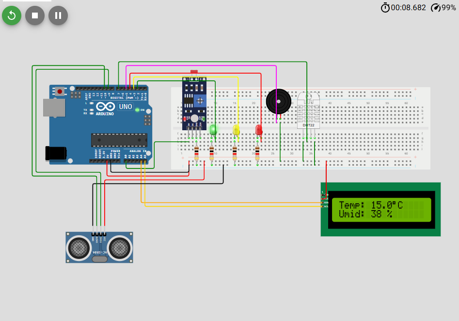

# Sistema de Monitoramento Preventivo Ambiental e de Nível de Água em Bueiros (Wokwi)

Este repositório contém o projeto de um sistema físico multifuncional para monitoramento preventivo de bueiros, simulado no ambiente Wokwi. O sistema visa detectar o risco de alagamento (monitorando o nível da água com um sensor ultrassônico HC-SR04) e coletar dados ambientais (umidade/temperatura com DHT22, luminosidade com LDR) que auxiliam na identificação precoce de problemas e na tomada de ações preventivas. As informações são exibidas de forma clara e alternada em um display LCD I2C, complementadas por alertas locais visuais (LEDs) e sonoros (buzzer).

## 1. Descrição Completa do Problema e Foco na Prevenção

O problema central abordado é o alagamento de ruas em áreas urbanas devido a bueiros obstruídos ou sobrecarregados, um cenário comum com graves consequências: congestionamentos, danos materiais e riscos à segurança. A abordagem tradicional de agir após o alagamento é reativa e custosa.

O foco deste projeto é a prevenção. Ao monitorar continuamente não só o nível da água, mas também outros indicadores como umidade, temperatura e luminosidade dentro do bueiro, o sistema fornece informações valiosas para identificar potenciais problemas antes que eles causem um transbordamento. O objetivo é permitir uma gestão proativa da infraestrutura de drenagem, possibilitando intervenções (como limpeza ou reparos) baseadas em dados, antes que a situação se torne crítica.

## 2. Visão Geral da Solução Preventiva (Wokwi)

A solução utiliza um Arduino (simulado no Wokwi) conectado a múltiplos sensores para coletar dados cruciais:
*   **Nível da Água:** Sensor ultrassônico HC-SR04 (4 pinos) mede a distância até a água, indicando o risco de transbordamento.
*   **Condições Ambientais:** Sensor DHT22 mede temperatura e umidade, que podem indicar infiltrações, evaporação ou condições anormais.
*   **Luminosidade:** Fotoresistor (LDR) mede a luz ambiente, podendo indicar obstrução na entrada do bueiro ou problemas na tampa.

O sistema classifica o nível da água (Normal, Atenção, Alerta) e aciona LEDs e um buzzer para os alertas. Todas as informações relevantes (status do nível, distância, temperatura, umidade, luminosidade) são exibidas de forma alternada no display LCD 16x2 I2C, facilitando a leitura e interpretação dos dados no local.

### 2.1. Importância da Solução e dos Dados para Prevenção

*   **Nível da Água (HC-SR04):** Indicador direto de risco. O estado "Atenção" sinaliza a necessidade de inspeção e limpeza preventiva.
*   **Temperatura/Umidade (DHT22):** Variações anormais podem indicar problemas estruturais, bloqueios ou infiltrações, justificando inspeção.
*   **Luminosidade (LDR):** Mudanças drásticas podem indicar tampa danificada/removida ou obstrução na entrada por lixo, permitindo limpeza antes da chuva.
*   **Alertas Visuais/Sonoros:** Sinalização imediata de risco (Atenção/Alerta).
*   **Display LCD Alternado:** Facilita a visualização sequencial e clara de cada parâmetro monitorado.

### 2.2. Componentes Utilizados

*   1x Placa Arduino Uno R3
*   1x Sensor Ultrassônico HC-SR04 (4 pinos)
*   1x Sensor de Temperatura e Umidade DHT22
*   1x Fotoresistor (LDR)
*   1x Display LCD 16x2 com Módulo I2C
*   1x LED Verde, 1x LED Amarelo, 1x LED Vermelho (5mm)
*   1x Buzzer Ativo (Piezo Speaker)
*   4x Resistores (3x 220Ω para LEDs, 1x 10kΩ ou 1kΩ para LDR)
*   1x Protoboard (Breadboard)
*   Fios Jumper

### 2.3. Montagem do Circuito

A conexão dos componentes no Wokwi deve seguir o esquema detalhado abaixo:

*   **Alimentação:** 5V e GND do Arduino aos barramentos da protoboard.
*   **HC-SR04:** VCC->5V, Trig->D9, Echo->D10, GND->GND.
*   **DHT22:** VCC->5V, Data->D7, GND->GND.
*   **LDR (Divisor de Tensão):** LDR(T1)->5V; LDR(T2)->A0; Resistor(1k/10k)->A0 e GND.
*   **LCD I2C:** GND->GND, VCC->5V, SDA->A4, SCL->A5.
*   **LEDs (c/ Resistor 220Ω):** Verde(A)->R->D2, C->GND; Amarelo(A)->R->D3, C->GND; Vermelho(A)->R->D4, C->GND.
*   **Buzzer:** (+) -> D5, (-) -> GND.

### 2.4. Lógica de Funcionamento (com LCD Alternado)

1.  **Inicialização:** Configura pinos, inicializa sensores e LCD.
2.  **Leitura Contínua:** O loop principal lê sequencialmente os sensores HC-SR04, DHT22 e LDR.
3.  **Processamento e Alerta:** Calcula a distância, determina o status do nível da água (Normal/Atenção/Alerta) e aciona os LEDs/Buzzer correspondentes.
4.  **Exibição Alternada no LCD:** Utilizando a função `millis()`, o sistema alterna a cada ~1.5 segundos entre três telas no LCD:
    *   Tela 0: Nível da Água (Status e Distância cm).
    *   Tela 1: Temperatura (°C) e Umidade (%).
    *   Tela 2: Luminosidade (Valor bruto do LDR e indicação Alta/Baixa).
5.  **Monitor Serial:** Envia todos os dados brutos e status para depuração.
6.  **Repetição:** O ciclo se repete, garantindo monitoramento constante e exibição atualizada.

## 3. Código Fonte

O código fonte (`monitoramento_wokwi_v5_alternado.ino`), que implementa a exibição alternada no LCD, está incluído neste repositório.

## 3.1 Imagem do Projeto

## 4. Guia para Simular o Projeto no Wokwi

Para montar e simular o projeto:

1.  Abra o Wokwi e crie um novo projeto Arduino Uno.
2.  Adicione os componentes listados na seção 2.2.
3.  Conecte os componentes seguindo o esquema da seção 2.3 (e a Figura 1 que você irá inserir).
4.  Copie e cole o código acima no editor `sketch.ino`.
5.  Inicie a simulação.
6.  Observe o LCD alternar entre as telas e o Monitor Serial.
7.  Interaja com os sensores (clicando neles) para testar as diferentes condições e alertas.

## 5. Links Importantes

*   **Link direto para o projeto no Simulador Wokwi:**
    *   https://wokwi.com/projects/433025962795675649
*   **Link para o Vídeo Demonstrativo:**
    *   https://drive.google.com/file/d/1DuwIhp3-RgId4WJEpyjVgsr3L8K5jQG_/view?usp=drivesdk

## 6. Desenvolvedores
Mikael de Albuquerque Santana RM 566507
Murilo Cruz                   RM 563743 
Otávio Magno da Silva         RM 566149

